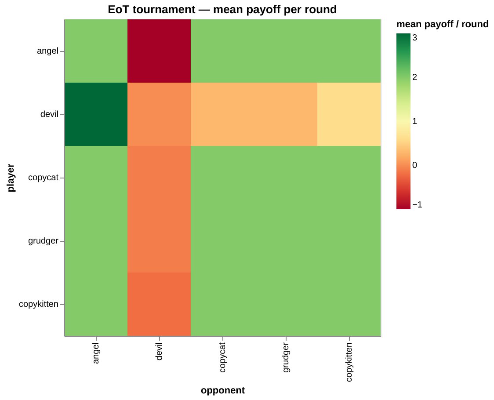

# Target — tournament heatmap

**Research question:** in a mixed field of all five strategies, which performs best?

Reproduce this figure, starting from your working `02_interact.py`:

## Pinned computation (do not reinterpret)

- Play a **round-robin**: every strategy vs every strategy, **including the diagonal**
  (self-play), all five: `angel, devil, copycat, grudger, copykitten`.
- **10 rounds** per match, default payoff (`R,S,T,P = 2,-1,3,0`), **no noise** (both noise sliders at 0).
- Cell value = **mean payoff per round** for the *row* strategy against the *column*
  strategy (so values sit on the payoff scale, roughly −1…3).

## You decide (presentation is open)

Row/column order · colour scheme & direction · annotations · title · exact sizing.
Many choices are defensible — pick one and be able to justify it.

## Acceptance invariants — verify before you trust the figure

Run these yourself (10 rounds, default payoff). The figure looking right is **not**
enough.

| Check | Expected (cumulative A / B) | Why it's here |
|---|---|---|
| **Angel vs Devil** | −10 / +30 | control — a fixed oracle, no strategy memory |
| **Copycat vs Copycat** | cooperative (20 / 20) | necessary but **not sufficient** |
| **Copycat vs Devil** | **−1 / +3** | the discriminating check |

If Copycat vs Devil gives −10 / +30, Copycat never retaliated. One "obvious" test
(self-play) passes anyway; that's the lesson.

## Follow-up targets (pinned computation)

Same round-robin and payoff as above. The question and its answer are on the
exercise page.

| Figure | Pinned computation |
|---|---|
| `eot-leaderboard-vs-rounds.png` | **tournament score** = mean of `mean_payoff_a` over all 5 opponents (incl. self-play), one round-robin per match length, **rounds 1–20** |
| `eot-match-margin-heatmap.png` | **match margin** = `score_a − score_b`, 10 rounds; > 0 the row strategy won the match, < 0 it lost |

# Afternoon target — the maps (`eot-maps.png`, exercise 08)

**Research question:** *where* in (rounds × noise) does cooperation survive, and *which*
strategy wins there?

| Pinned | Value |
|---|---|
| starting population | all five strategies, 5 each (25 agents) |
| evolution | your `simulate` (04's toy rule: drop the 5 lowest, clone the 5 highest), 30 generations |
| rounds per match | 2, 3, 5, 10, 20 |
| noise | 0, 0.02, 0.05, 0.1, 0.2 |
| seeds | 0, 1, 2 |
| one run's file | `results/sim/rounds-{rounds}_noise-{noise}_seed-{seed}.csv` |
| cooperation (left map) | last generation's share of cooperative moves, **mean over seeds** |
| winner (right map) | per seed: the largest group in the last generation (`tie` if several share the top); across seeds: the **strict majority**, else `tie` |
